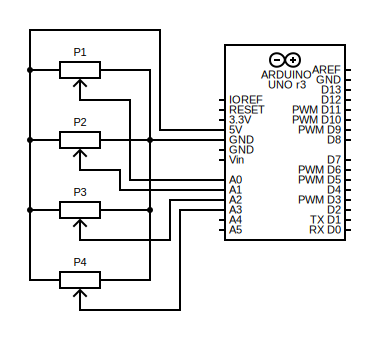
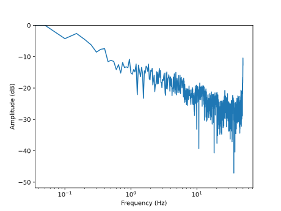

# Binary Potentiometer Midi Controller

This project uses the binary combination of four potentiometers to select and send midi signals using an Arduino and python. As there are four pots, there are 16 combinations. The first is used for no note and the remaining 15 are mapped to notes in either the major, minor or blues scales or can be mapped linearly.

Printable CAD files and circuit schematics are provided below.

For a video demonstration of this project:
[demo video](https://www.drupal.org/project/admin_menu)

## Table of contents

- Installation
- Software Data Flow Diagram
- Necessary Modules
- Hardware
- Filter, Threshold and Scale Configuration
- Running the Software

## Installation

The repo should be cloned to a local machine with the capability of either outputting MIDI messgaes to an external synth or have a virtual synth installed through a DAW (Logic, Ableton, FL Studio, etc.) or another means (Microsoft GS Wavetable is preinstalled on windows machines)

## Software Data Flow Diagram

## Necessary Modules

This module requires the following modules which should be installed to the python virtual environment:

- `pip install pyFirmata2`
    &emsp;&emsp;[PyFirmata2](https://pypi.org/project/pyFirmata2/)

- `pip install py-iir-filter`
    &emsp;&emsp;[IIR-Filter](https://pypi.org/project/py-iir-filter/)

- `pip install python-rtmidi`
    &emsp;&emsp;[RtMIDI](https://pypi.org/project/python-rtmidi/)

- `pip install matplotlib`
- `pip install numpy`
- `pip install scipy`

## Hardware

The necessary circuit schematic can be observed below:

The arduino should be connected to the computer which will be runnning the software.

The potentiometers P1 - P4 can be any resistance and physical dimension and should be decided on depending on the design desired. Standard pots on a breadboard work well, but linear sliding pots can also be constructed using `/CAD/table_slider`, card stock, graphite, aluminum foil, blue tac or glue and 16 2M screws if desired. Both of these implementations are pictured below:

## Filter, Threshold and Scale Configuration

To determine the cutoff frequency required for your pots, run freqSpectrum.py after connecting a pot to 5V, GND and A0. The FFT of your signal will be output to `/figs/freqPlot.svg` and can be used to determine the filter cutoff, if necessary. An example with a spike at 50 Hz from mains noise can be observed below:

Generally 5 Hz is advised as it is unlikely any user interaction would happen at a higher frequency than this and removed the noisy frequencies. Lower cutoffs than this can introduce delay.

The activation thresholds for turning a slider to be recognized as 'on' and the threshold for modulation can both be changed in main.py. The scale spacing of the notes and base note can also be changed in main.py.

## Running the Software

Run main.py with your synth connected or your virtual synth open (if using Microsoft GS Wavetable nothing needs to be done).